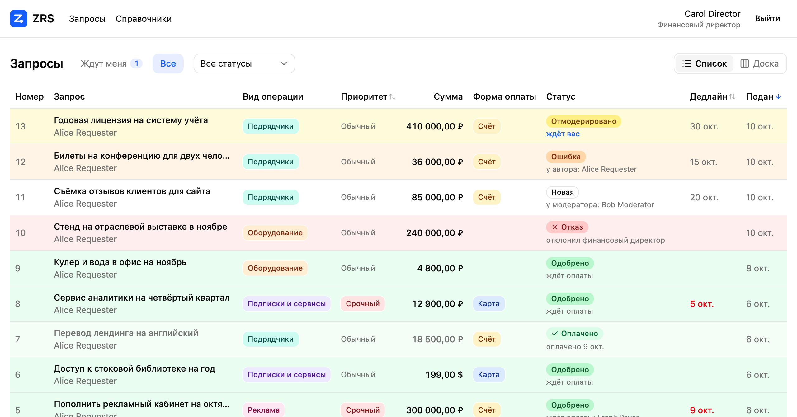
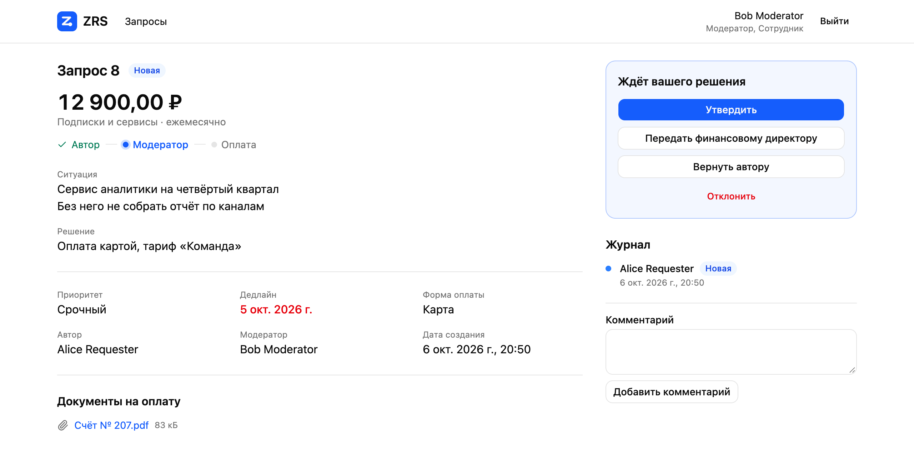
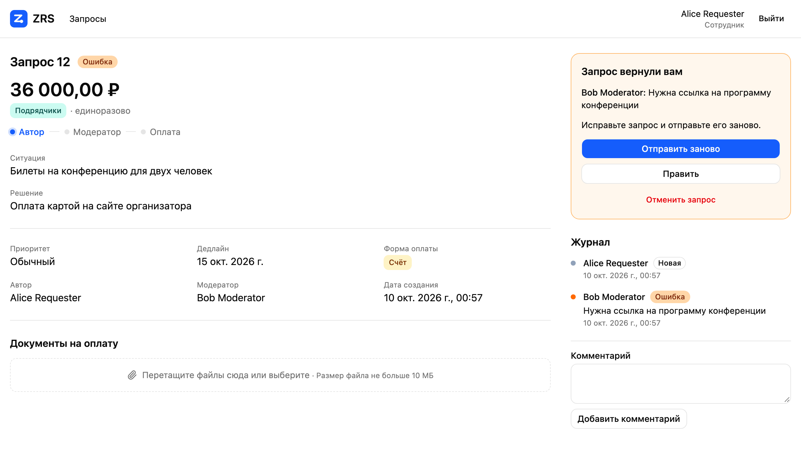
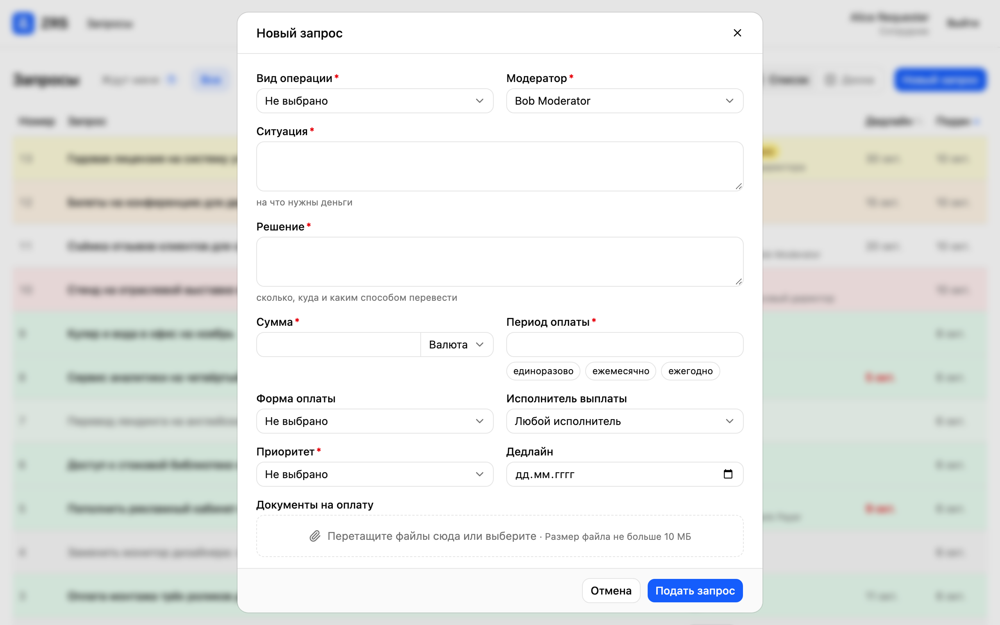
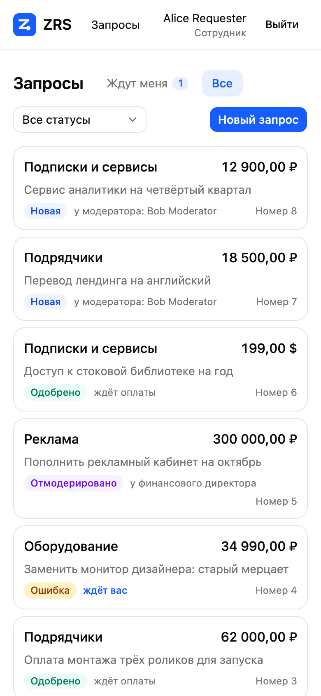
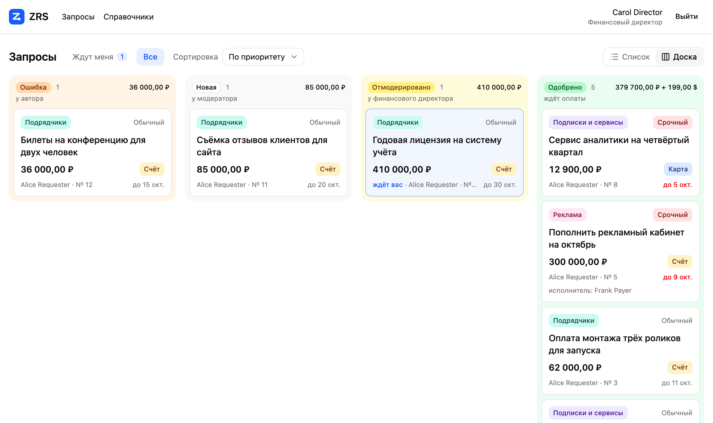
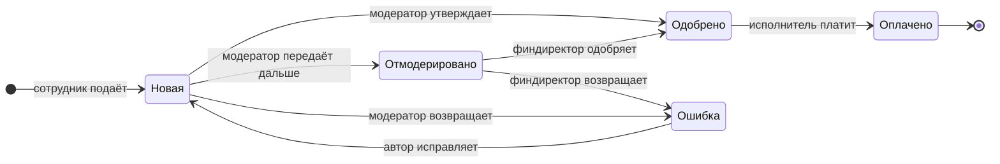

<p align="center">
  
</p>

<h1 align="center">ZRS</h1>

<p align="center">
  Запросы на расход средств: подать, согласовать, оплатить.
</p>

<p align="center">
  <a href="https://github.com/adalekin/zrs/actions/workflows/ci.yml"></a>
  <a href="https://github.com/adalekin/zrs/tags"></a>
  <a href="LICENSE"></a>
</p>

<p align="center">
  
</p>

Сотрудник пишет, на что нужны деньги и как их перевести. Модератор утверждает запрос или передаёт его финансовому директору. Исполнитель выплаты платит и отмечает оплату. Запросу можно назначить исполнителя, и тогда платит только он. Каждое решение остаётся в журнале запроса.

Одна установка обслуживает одну организацию. Учётные записи и роли остаются в вашем провайдере входа, ZRS их не хранит.

## Как это выглядит

Сервис не шлёт уведомлений, поэтому каждый экран отвечает на два вопроса: что нужно от меня и у кого сейчас запрос.

<table>
  <tr>
    <td width="50%" valign="top">
      
      <p><b>Решение рядом с запросом.</b> Слева то, что нужно прочитать. Справа одно главное действие, остальные тише, отказ отдельно.</p>
    </td>
    <td width="50%" valign="top">
      
      <p><b>Возврат с причиной.</b> Автор видит, кто вернул запрос и почему, правит его и отправляет заново тому же модератору.</p>
    </td>
  </tr>
</table>

<table>
  <tr>
    <td width="66%" valign="top">
      
      <p><b>Запрос в одном окне.</b> Поля, документы на оплату и модератор в одной форме. Начатый текст переживает закрытие окна и перезагрузку страницы.</p>
    </td>
    <td width="34%" valign="top" align="center">
      
      <p align="left"><b>С телефона.</b> Список складывается в карточки, запрос в одну колонку.</p>
    </td>
  </tr>
</table>

<table>
  <tr>
    <td valign="top">
      
      <p><b>Доска по этапам.</b> Те же запросы колонками по статусам, в порядке пути запроса. В заголовке колонки число запросов и сумма, карточки по приоритету и дедлайну, запросы своей очереди отмечены.</p>
    </td>
  </tr>
</table>

## Путь запроса



На схеме нет статуса «Отказ». В него запрос переводят модератор или финансовый директор на своём шаге, а автор может отменить запрос сам, пока он не оплачен.

Запрос может быть периодическим: раз в неделю, месяц, квартал или год. Его согласуют один раз, а платят каждый период. После отметки оплаты он остаётся одобренным, уходит из очереди исполнителя и возвращается в неё в первый день следующего периода. Каждая оплата записана с датой и суммой. Когда платежи больше не нужны, автор или финансовый директор завершает запрос.

| Роль | Что делает |
|---|---|
| Сотрудник | подаёт запросы, правит и отменяет свои, завершает свои периодические |
| Модератор | утверждает, передаёт финансовому директору, возвращает или отклоняет запросы, где он выбран |
| Финансовый директор | решает по переданным запросам, меняет исполнителя одобренного запроса, завершает периодические и ведёт справочники |
| Исполнитель выплаты | платит по одобренным запросам, которые назначены ему или никому, и отмечает оплату |

Второй уровень согласования включает сам модератор: запрос, который он передал, ждёт финансового директора. Финансовый директор не решает по запросу, где он автор или модератор.

## Попробовать

Нужен Docker с Compose.

```bash
git clone https://github.com/adalekin/zrs.git
```

```bash
cd zrs && docker compose up --build
```

Команда собирает сервер и веб-интерфейс из исходников и поднимает рядом PostgreSQL, S3-совместимое хранилище и тестового провайдера входа. Интерфейс открывается на http://localhost:3300.

Тестовые пользователи, пароль совпадает с именем:

| Имя | Роли |
|---|---|
| `alice` | сотрудник |
| `bob` | сотрудник, модератор |
| `carol` | финансовый директор |
| `dave` | исполнитель выплаты |
| `frank` | исполнитель выплаты |
| `eve` | без ролей |

На новой установке справочники пусты, поэтому первой входит `carol` и добавляет виды операций и приоритеты. Модератора можно выбрать только из тех, кто уже входил, так что `bob` тоже должен войти один раз.

Всё в корневом `compose.yaml` рассчитано на разработку: пароли записаны в файле, провайдер тестовый. Для боевой установки он не годится.

## Установка

Образы и чарт публикуются в GitHub Container Registry под одной версией:

| Что | Адрес |
|---|---|
| Сервер | `ghcr.io/adalekin/zrs-server` |
| Веб-интерфейс | `ghcr.io/adalekin/zrs-web` |
| Helm-чарт | `oci://ghcr.io/adalekin/charts/zrs` |

Перед каждым запуском новой версии выполняются миграции базы: `alembic upgrade head` в образе сервера. И пример Compose, и чарт делают это сами.

### Helm

```bash
helm install zrs oci://ghcr.io/adalekin/charts/zrs --version 0.4.3 -f values.yaml
```

Полный пример значений лежит в `deploy/helm/zrs/ci/example-values.yaml`. Чарт ставит сервер, веб-интерфейс и Job с миграциями. PostgreSQL, хранилище и провайдера входа он не поднимает.

- Секреты задаются именем существующего Secret в `secrets.existingSecret` или значениями в `secrets.values`.
- Наружу выводится только веб-интерфейс: через `ingress` чарта или через свой маршрут поверх Service.
- Поды сервера становятся готовыми после того, как Job довёл схему базы до их версии.
- `podAnnotations` и `podLabels` задаются отдельно для сервера, веб-интерфейса и Job.

Образы и чарт лежат в открытых пакетах: для скачивания не нужны ни вход в реестр, ни `imagePullSecrets`.

### Docker Compose

`deploy/compose.yaml` запускает опубликованные образы и PostgreSQL. Провайдер входа и хранилище у вас свои. Переменные перечислены в начале файла, без любой из них Compose назовёт её имя.

```bash
docker compose -f deploy/compose.yaml up -d
```

Веб-интерфейс слушает порт `ZRS_HTTP_PORT` без TLS, перед ним ставится ваш прокси. Cookie сессии хранит токены провайдера и занимает несколько килобайт, поэтому предел размера заголовков у прокси стоит поднять до 16 КБ.

## Провайдер входа

ZRS работает с любым провайдером OpenID Connect, который выполняет три условия:

1. Токен доступа выдаётся в формате JWT и подписан ключом из JWKS провайдера.
2. В поле `aud` токена доступа лежит значение, заданное установке в `OIDC_AUDIENCE`. У многих провайдеров это отдельная настройка клиента.
3. Роли человека перечислены в токене доступа, а его имя отдаёт UserInfo Endpoint (область `profile`).

Сервер сам проверяет подпись, издателя, получателя и срок действия токена. Токен, выпущенный для другого приложения того же провайдера, он не примет.

Человек попадает в список людей при первом входе. Выбрать модератором можно только того, кто уже входил.

Роли удобно держать как роли клиента: в Keycloak это клиентские роли, и в токен они попадают в поле `resource_access.<клиент>.roles`.

## Настройки

Значений по умолчанию нет. Сервер и веб-интерфейс не запускаются без любой из настроек и называют её в сообщении об ошибке.

<details>
<summary>Сервер</summary>

| Переменная | Что задаёт |
|---|---|
| `OIDC_ISSUER` | адрес издателя, например `https://idp.example.com/realms/main` |
| `OIDC_AUDIENCE` | ожидаемое значение `aud` токена доступа |
| `OIDC_ROLES_CLAIM` | где в токене перечислены роли: имя поля (`groups`) или путь через точку (`resource_access.zrs.roles`) |
| `ROLE_REQUESTER` | значение провайдера для роли сотрудника |
| `ROLE_MODERATOR` | значение провайдера для роли модератора |
| `ROLE_FINANCE_DIRECTOR` | значение провайдера для роли финансового директора |
| `ROLE_PAYER` | значение провайдера для роли исполнителя выплаты |
| `CURRENCIES` | коды валют ISO 4217 через запятую, например `EUR,USD` |
| `ATTACHMENT_MAX_BYTES` | предельный размер документа на оплату в байтах |
| `TIMEZONE` | часовой пояс тех, кто проводит платежи, по базе IANA, например `Europe/Berlin` |
| `PAYMENT_DAY_ENDS_AT` | время в этом поясе, после которого платёж в тот же день не проводят, например `16:30`; форма запроса предупреждает о дедлайне, к которому не успеть |
| `NOTIFICATIONS` | `telegram` или `off`: сообщать ли людям о запросах в Telegram |
| `TELEGRAM_BOT_TOKEN` | токен бота, при `NOTIFICATIONS=telegram` |
| `TELEGRAM_BOT_USERNAME` | имя бота без `@`, при `NOTIFICATIONS=telegram` |
| `TELEGRAM_EGRESS` | `direct` или `proxy`: как сервер добирается до `api.telegram.org`, при `NOTIFICATIONS=telegram` |
| `TELEGRAM_PROXY_URL` | адрес прокси, например `socks5://proxy.internal:1080`, при `TELEGRAM_EGRESS=proxy` |
| `TELEGRAM_DECISIONS` | `on` или `off`: можно ли решать по запросу кнопками в чате с ботом, при `NOTIFICATIONS=telegram` |
| `S3_ENDPOINT_URL` | адрес S3-совместимого хранилища |
| `S3_BUCKET` | имя бакета, он должен существовать |
| `S3_REGION` | регион хранилища |
| `S3_ACCESS_KEY_ID` | ключ доступа к хранилищу |
| `S3_SECRET_ACCESS_KEY` | секрет ключа доступа |
| `DB_HOST` | адрес PostgreSQL |
| `DB_PORT` | порт PostgreSQL |
| `DB_NAME` | имя базы |
| `DB_USER` | пользователь базы |
| `DB_PASSWORD` | пароль пользователя базы |

Одно значение провайдера можно назначить нескольким ролям. Тогда человек с этим значением получает их все.

</details>

<details>
<summary>Веб-интерфейс</summary>

| Переменная | Что задаёт |
|---|---|
| `OIDC_ISSUER` | адрес издателя, тот же, что у сервера |
| `OIDC_CLIENT_ID` | клиент, через которого входят люди |
| `OIDC_CLIENT_SECRET` | секрет клиента |
| `AUTH_SECRET` | случайная строка, которой шифруется cookie сессии |
| `AUTH_ORIGIN` | публичный адрес интерфейса, например `https://zrs.example.com` |
| `API_URL` | адрес сервера внутри сети установки, например `http://server:8000` |
| `UI_LOCALE` | язык интерфейса: `ru` или `en` |

Браузер обращается только к веб-интерфейсу. Сервер наружу публиковать не нужно.

</details>

### Уведомления в Telegram

При `NOTIFICATIONS=telegram` бот пишет человеку, когда запрос ждёт его действия, автору о решении и о каждой оплате, автору и модератору о комментарии. Бота создаёт организация у [@BotFather](https://t.me/BotFather): токен идёт в `TELEGRAM_BOT_TOKEN`, имя в `TELEGRAM_BOT_USERNAME`. Каждый человек сам привязывает свой Telegram на странице «Уведомления» и может отвязать его. У каждой установки свой бот: прочитанное обновление Telegram считает полученным, и вторая установка с тем же токеном забирала бы чужие привязки.

При `TELEGRAM_DECISIONS=on` сообщение модератору и финансовому директору несёт кнопки: утвердить или одобрить, передать финансовому директору, вернуть, отклонить. Перед возвратом и отказом бот спрашивает причину. Решение принимается от имени человека, к которому привязан чат, с ролями его последнего входа в сервис и без нового входа: включайте это, если такой порядок допустим в организации. Оплата, отмена и правка запроса остаются в сервисе.

Серверу нужен исходящий доступ к `api.telegram.org`. Если напрямую его нет, задайте `TELEGRAM_EGRESS=proxy` и адрес прокси в `TELEGRAM_PROXY_URL`. Пока Telegram недоступен, запросы согласуют и оплачивают как обычно, а сообщения уходят после восстановления связи.

## Из чего состоит

| Папка | Что в ней |
|---|---|
| `server/` | сервер с API: Python 3.12, FastAPI, PostgreSQL |
| `web/` | веб-интерфейс: Nuxt, shadcn-vue |
| `deploy/` | пример боевого `compose.yaml` и Helm-чарт |
| `dev/` | файлы окружения разработки: тестовый провайдер, хранилище, тестовая база |
| `openspec/` | спецификации и планы изменений |

## Разработка

Тесты сервера идут на PostgreSQL из корневого `compose.yaml`, в отдельной базе `zrs_test`, которую они пересобирают при каждом запуске:

```bash
docker compose up -d postgres
```

```bash
cd server && uv sync --python 3.12 && uv run pytest
```

Проверки веб-интерфейса:

```bash
cd web && bun install && bun run typecheck && bun run test
```

Поведение описано в `openspec/`. Изменение поведения начинается со спецификации там же.

## Выпуск версии

Git-тег `vX.Y.Z` запускает сборку: оба образа и чарт публикуются под версией `X.Y.Z`.

## Лицензия

MIT, текст в файле `LICENSE`.
